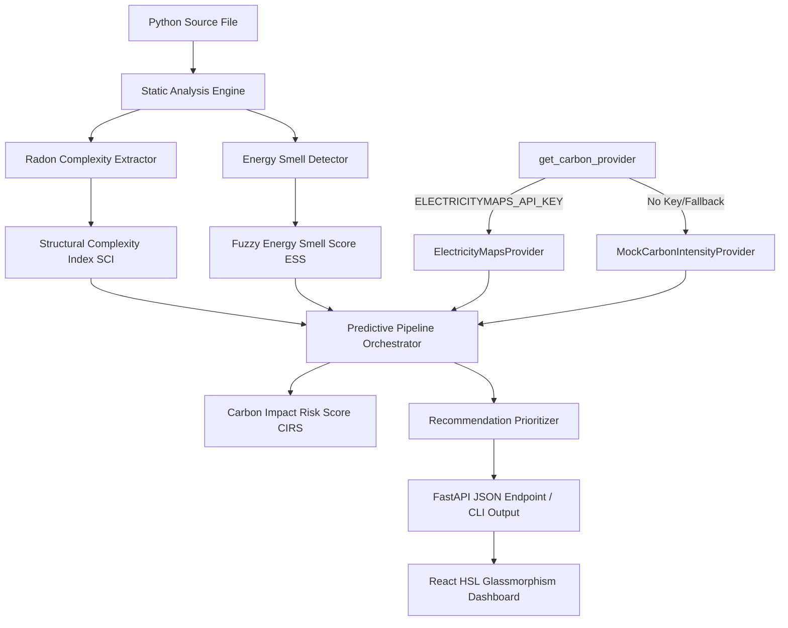

# Code-Carbon: A Sustainability-First Framework for Carbon-Aware Software Engineering

Code-Carbon is a modular, publication-oriented research framework designed to analyze Python source code, detect energy inefficiencies (energy smells), and estimate runtime carbon footprints early in the software development life cycle (SDLC).

---

## 1. System Features

*   **Static AST Analysis**: Comprehensive parsing of function calls, loops, complexity indices, file/network operations, and recursion behaviors without executing the source file.
*   **Energy Knowledge Base (EKB)**: Declares 12 distinct energy smell detection rules backed by research.
*   **Radon Complexity Metrics**: Calculates Cyclomatic Complexity, Maximum Nesting Depth, and Function Density to derive a Structural Complexity Index (SCI).
*   **RAPL Hardware Profiling & Estimation**: Models runtime energy footprint in Joules using standard references and normalized hardware profiles.
*   **Carbon Intensity Provider Abstraction**:
    *   **Live Provider**: Integrates the Electricity Maps API to retrieve marginal carbon grid intensities (gCO₂eq/kWh) for specified regional zones.
    *   **Mock Provider Fallback**: Diurnal sine-simulated grid forecast and zone database supporting completely offline or fallback execution when no API key is present.
*   **Carbon-Aware Recommendation Engine**: Maps AST smell detections to optimization recommendations, prioritizing fixes based on carbon impact.
*   **FastAPI backend**: Unified OpenAPI endpoint server (`/analyze`, `/zones`, `/search-zones`, `/health`).
*   **React Dashboard**: Dark-themed user visualizer with chart widgets showing regional grid intensity comparisons and smell breakdowns.

---

## 2. Architecture Diagram



---

## 3. Project Structure

```
Code-Carbon-Project/
├── dashboard/               # React + TypeScript Vite visualizer dashboard
│   ├── src/
│   │   ├── App.tsx          # Main panel, dropzones, Recharts widgets
│   │   └── index.css        # Custom HSL glassmorphism dark-mode styles
│   └── package.json
│
├── docs/
│   └── api.md               # Detailed developer API documentation
│
├── src/
│   ├── analysis/            # AST parsing visitors (loops, recursion, I/O)
│   ├── knowledge/           # YAML energy smell rule definitions
│   ├── detector/            # Smell engine (registries, confidence scoring)
│   ├── complexity/          # Structural complexity (Radon adaptations)
│   ├── hardware_profile/    # Normalized hardware database
│   ├── energy/              # RAPL runtimes & estimates
│   ├── carbon/              # Live API clients, provider factory, models
│   │   ├── api.py           # Electricity Maps v4 client
│   │   ├── providers.py     # CarbonIntensityProvider interface & implementations
│   │   └── engine.py        # Emission estimator
│   │
│   ├── sustainability/      # Fuzzy ESS and CIRS math engines
│   │   └── metrics.py
│   │
│   ├── recommendation/      # Carbon-aware recommendation pipeline
│   │   ├── engine.py        # Recommendations generator
│   │   └── prioritizer.py   # Multiplicative exposure risk ranking
│   │
│   └── api/                 # FastAPI router routes & schemas
│       ├── main.py
│       └── models.py
│
├── tests/                   # 92 unit and mathematical tests
└── .env                     # Local environment keys (e.g. ELECTRICITYMAPS_API_KEY)
```

---

## 4. Installation

### Python Backend
Ensure Python 3.10+ is installed. Clone the repository and run:
```powershell
# Install project dependencies in editable mode
pip install -e .
```

### React Frontend
Ensure Node.js 18+ is installed:
```powershell
cd dashboard
npm install
```

---

## 5. Usage & Examples

### Configure Environment
Create a `.env` file in the root directory to activate the live Electricity Maps API:
```ini
ELECTRICITYMAPS_API_KEY=your_electricitymaps_api_token
```
*Note: If no API key is specified, the system automatically runs using MockCarbonIntensityProvider.*

### CLI Operations
The CLI provides immediate estimation reports. Set python encoding for the subscript symbols on Windows:
```powershell
# Set environment
$env:PYTHONPATH="src"
$env:PYTHONIOENCODING="utf-8"

# 1. Run predictive carbon estimation on a file
python -m carbon.cli estimate examples/benchmarks/nested_loops.py --zone DK-DK1

# 2. Force Global Fallback average on network failures
python -m carbon.cli estimate examples/benchmarks/nested_loops.py --zone DK-DK1 --global-average

# 3. List supported regional grid codes
python -m carbon.cli zones

# 4. Search zones
python -m carbon.cli search-zones --query Denmark
```

### FastAPI Server Launch
Run the FastAPI application server:
```powershell
$env:PYTHONPATH="src"
uvicorn api.main:app --host 127.0.0.1 --port 8000 --reload
```
Interactive OpenAPI documentation will be exposed at `http://127.0.0.1:8000/docs`.

### Launch Dashboard Frontend
```powershell
cd dashboard
npm run dev
```
Open `http://localhost:5173` to upload files, configure grids, and visualize estimations.

---

## 6. Testing Instructions

To run the complete 92-test suite covering AST visitors, EKB rules, Radon adaptions, API client responses, provider switching, and mathematical validation curves:
```powershell
$env:PYTHONPATH="src"
python -m unittest discover -s tests -v
```

To run a sensitivity and ablation evaluation matching academic review validation parameters, execute:
```powershell
python "scratch/generate_validation_report.py"
```
This produces `validation_tables.md` in your outputs containing sensitivity grids for fuzzy joint possibilities.

---

## 7. Future Work

*   **Machine Learning Calibration**: Incorporate empirical RAPL prediction models trained across differing container workloads to replace static complexity estimations.
*   **Dynamic Validation**: Integrate real-time runtime profiles (e.g. standard profilers or Prometheus carbon metrics) alongside static analyses.
*   **IDE Extension Ecosystem**: Package Code-Carbon into VSCode and JetBrains extensions to flag code smells directly in code editors.